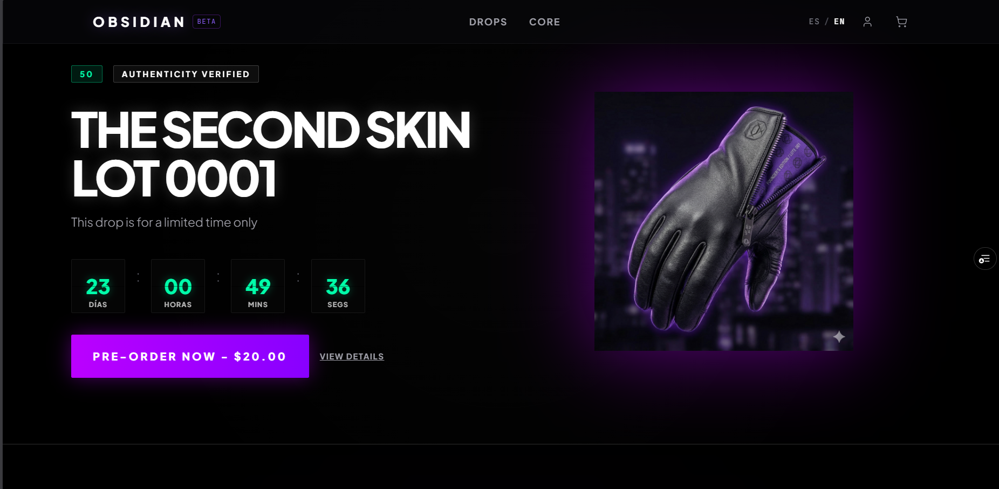
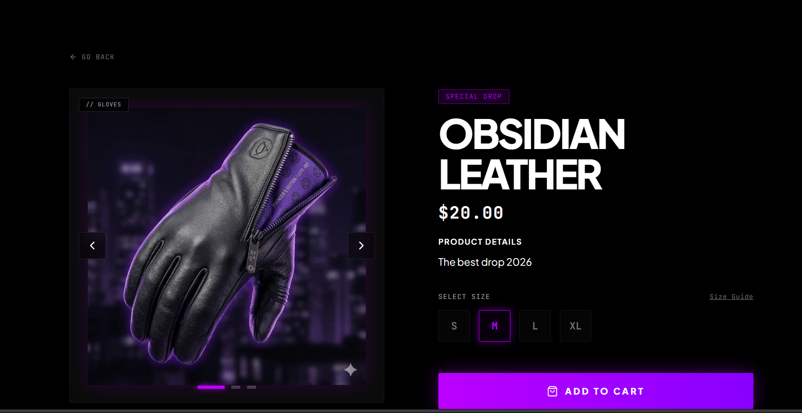
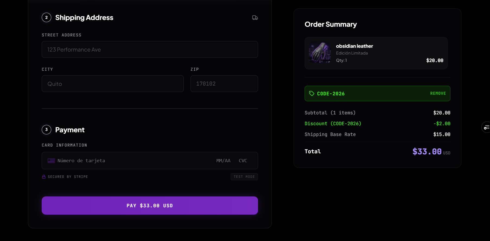
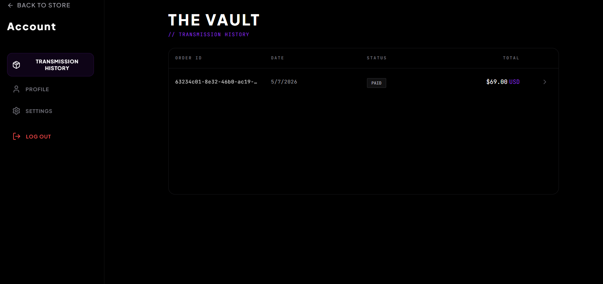

<div align="center">
  

  #  OBSIDIAN
  **Premium Headless E-Commerce Platform**
  
  <p align="center">
    <a href="https://obsidian-frontend-alpha.vercel.app/"><strong>Live Demo</strong></a> ·
    <a href="https://github.com/OliverCr11/Obsidian.git"><strong>Frontend Repo</strong></a> ·
    <a href="https://github.com/OliverCr11/obsidian-backend.git"><strong>Backend Repo</strong></a>
  </p>

  <p align="center">
    
    
    
    
    
  </p>
</div>

---

## Overview

**OBSIDIAN** is a cutting-edge, high-performance headless e-commerce application designed with a distinctive "Dark Luxury Tech" aesthetic. Built with a decoupled architecture, it leverages a highly reactive React/TypeScript frontend and a robust Django REST Framework backend to deliver a seamless, secure, and visually striking user experience.

## Core Architecture

The platform operates on a strictly separated headless architecture:

### Frontend
- **Framework:** React 18 with Vite for lightning-fast HMR and optimized builds.
- **Language:** Strictly typed with TypeScript for enhanced developer experience and error reduction.
- **Styling:** Tailwind CSS, utilizing a custom design token system built around deep blacks, tactical minimalist UI, and vibrant violet accents.
- **State & Routing:** Contextual state management, Axios (with robust JWT interceptors for seamless session handling), and React Router DOM.
- **Deployment:** Vercel

### Backend
- **Framework:** Django & Django REST Framework (DRF)
- **Database:** PostgreSQL
- **Security:** Advanced CORS handling, Custom User models, and SimpleJWT for token-based authentication.
- **Deployment:** Railway

### Third-Party Integrations
- **Stripe API:** End-to-end secure payment gateway processing via Payment Intents.
- **Resend API:** Transactional email dispatch for immediate order confirmations.

## Key Engineering Features

- **Robust Authentication Flow:** Complete JSON Web Token (JWT) based login/registration system with protected routes. Includes graceful degradation to guest modes upon token expiry and background refresh logic.
- **Stripe Checkout Pipeline:** Fully integrated Stripe Elements for a frictionless checkout experience, featuring atomic database transactions ensuring order integrity strictly upon successful payment resolution.
- **"The Vault" (User Dashboard):** A secure, authenticated area where users can retrieve and analyze their encrypted transmission (order) history directly from the PostgreSQL database, featuring a custom accordion UI for itemized breakdowns.
- **Cross-Origin Resource Sharing (CORS):** Highly secure and dynamic CORS implementations ensuring the Vercel edge deployment securely communicates with the Railway application servers.
- **Responsive "Dark Luxury" UI/UX:** A mobile-first design philosophy that guarantees the premium tactical aesthetic persists perfectly across all viewports and devices.

## Gallery

<div align="center">
  
  
</div>
<br/>
<div align="center">
  
  
</div>

## Local Development Setup

Follow these instructions to run the frontend client locally.

### Prerequisites
- Node.js (v18+)
- npm or yarn

### Installation

1. **Clone the repository:**
   ```bash
   git clone https://github.com/OliverCr11/Obsidian.git
   cd Obsidian
   ```

2. **Install dependencies:**
   ```bash
   npm install
   ```

3. **Environment Configuration:**
   Create a `.env` file in the root of the project and populate it with your local/testing variables:
   ```env
   # API Base URL (Point to your local Django server)
   VITE_API_URL=http://127.0.0.1:8000
   ```

4. **Launch the development server:**
   ```bash
   npm run dev
   ```

## License

Designed and Engineered by [Oliver Criollo](https://github.com/OliverCr11). All rights reserved.
